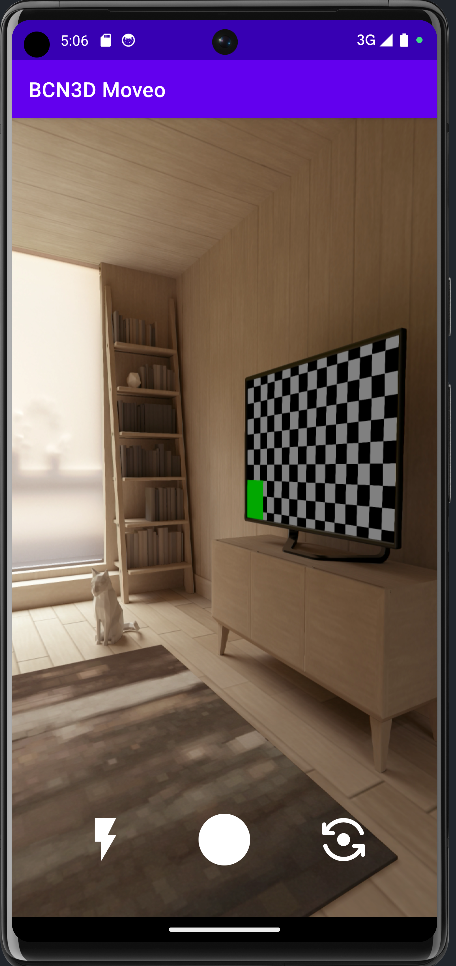

# Camera App
Welcome to the repository, this Android app allows you to capture images, use flash, rotate the camera and send images via UDP. Below you will find a brief description of the main features and instructions for use 

<p align="center">
  
</p>


# Main Features

## Advanced Photo Capture

The Camera app offers an advanced capturing experience, taking advantage of the camera capabilities of your Android device. You can capture high-quality images with just one touch.

## Flash adjustment

Change the flash status with a dedicated button. Choose between flash on and flash off to get the desired light in your image.

## Rotate Camera

Quickly switch between the front and rear cameras with the reverse button. This feature allows you to capture selfies or images of the surrounding scene with ease.

## Sharing via UDP

Send your photos to a specific server via UDP. This feature is implemented in the UDP class and can be activated when saving images.

# Configuration and Use

## Permissions Requirements:

Make sure you grant the app the necessary permissions. Open the app and allow access to the camera.
If necessary, enable Wi-Fi or automatically connect to a specific network using the code provided in the `MainActivity` class.

## WiFi Connection Setup

To automatically connect to your favorite WiFi network, follow these steps:
1. Open your project and go to the `MainActivity` class
2. Find the following lines of code:
    ```java
   private static final String SSID = "TIM-29562191";
   private static final String PASSWORD = "rq7ngXZMQlc3NTVl1pZCNTlK";
    ```
3. Replace `"TIM-29562191'` with the name of your WiFi network.
4. Replace `"rq7ngXZMQlc3NTVl1pZCNTlK'` with your WiFi network password.
5. Save the file and recompile the project.

Now your Android device will automatically connect to the configured WiFi network.

## Image Capture:
1. Press the center button to take a photo.
2. Captured images are saved to the images directory on your device.

## Flash adjustment:
Use the Flash button to turn the flash on or off depending on your needs.

## Reverse Camera:
Switch between the front and rear cameras with the flip Camera button.

## Sharing via UDP:
Sending via UDP is implemented in the `UDP` class. Make sure you correctly configure the server IP address and port in the class. (The IP to enter is that of the server)

# Python Server for Receiving Images

Additionally, in the repository, you will find a Python script that acts as a server to receive images sent from your Android app.

```python
#Imports modules
import socket

#Sets up listener
listensocket = socket.socket()
listenPort = 50001
numberOfConnections=999
thisIp = socket.gethostname()
listensocket.bind(('', listenPort))

#Starts Server
listensocket.listen(numberOfConnections)
print("Started Listening")

#Accepts Connection
(clientsocket, address) = listensocket.accept()
print("Connected")

#Define File Name
fname = "temp.jpeg"

#Opens File
f = open(fname, 'wb')
datain = 1

#Receives Image
while datain:
    datain = clientsocket.recv(999999999) #Gets incomming data
    f.write(datain) #Writes data to file

#Closes socket
f.close()
listensocket.close()
```

## How to Use the Python Server

Follow these steps to set up and use the Python server for receiving images:

1. **Install Python:**
   Make sure you have Python installed on your machine. You can download it from [python.org](https://www.python.org/).

2. **Clone the Repository:**
   Clone this GitHub repository to your local machine.
   ```bash
   git clone https://github.com/profumato4/Camera.git


3. **Navigate to the Server Directory:**
Go to the directory containing the Python server script.
```bash
cd Camera/Server
```

4. **Run the Server:**
Execute the Python script to start the server.
```bash
python server.py
```
5. The server will start listening for incoming image data.

6. **Configure the Android App:**
if you haven't already done so In your Android app code, make sure the server IP address and port match the values ​​specified in the Python script. Update the following line in your Android app's `UDP` class:
```java
s = new Socket("192.168.1.9", 50001); // update these values ​​with your server ip and your server port
```

7. **Run Your Android App:**
Build and run your Android app on a device or emulator. Capture an image using the app.

8. **Image transfer:**
The Python server will receive the image data from the Android app and save it as "temp.jpeg" in the same directory as the server script.

9. **Check the Output:**
Verify that the image was successfully received and saved by checking the "temp.jpeg" file in the server directory.

10. **Stop the Server:**
The server automatically stops after receiving the image. If you want to keep the server continuously active it would be enough to put all the code in a `while True:`, the received photo would be overwritten every time so changes would have to be made to the file name making it unique to example by setting the file name with milliseconds or something like that

# Contacts
For questions, suggestions or bug reports, please contact the following email [livgh34@gmail.com].

Thanks for contributing and using the Camera app!
